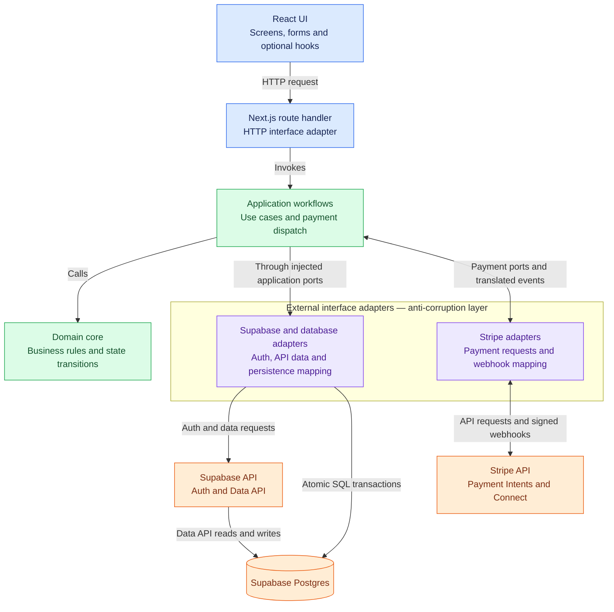

# Booking Web Manager

Sports venue booking coordination. One person books and pays a venue upfront,
participants commit their share into an in-app wallet where it is held, and
the held funds are released to the booker after attendance is verified.

NTU SC2006 group project, Group 3.

See [CLAUDE.md](./CLAUDE.md) for the full architecture, non-negotiable rules,
directory ownership and conventions. See [docs/](./docs) for the SRS.

## Architecture direction: Clean Architecture

We propose [Clean Architecture](https://blog.cleancoder.com/uncle-bob/2012/08/13/the-clean-architecture.html)
as the implementation structure: domain rules and use-case workflows stay
independent of React, Next.js, external APIs and database implementations. These
rules and workflows can be tested through plain TypeScript interfaces while
adapters handle HTTP and persistence. This framing is proposed and has not yet been
vetted against the course's expectations; the supplementary section below maps
it to the required use-case-driven design and BCE responsibilities.

Build from the inside out: **domain → use cases → interface adapters → React**.
The intended request and external integration flow is:



These arrows show **runtime calls and incoming events**. Source-code dependencies
point inward: use cases import the domain and define the application ports they
need; adapters implement those ports. The domain and use cases do not import
Next.js, React, Stripe, Supabase clients or concrete adapters.

The two planned external API integrations highlighted here are:

| External API | Role in the project |
| --- | --- |
| [Stripe API](https://docs.stripe.com/api) | PayNow wallet top-ups through Payment Intents, Connect payout setup and payment dispatch, with signed webhook notifications. |
| [Supabase API](https://supabase.com/docs/guides/api) | Authentication and application data access through Supabase Auth and the Data API. The API is shown separately from its Postgres database. |

The external interface adapters form the **anti-corruption layer**: they
translate provider payloads, identifiers, statuses and errors into the
application's own contracts, and translate outgoing requests back into provider
formats. The interfaces define those contracts; the adapter implementations
perform the translation. Business rules stay in the domain and workflow
coordination stays in use cases. See the
[anti-corruption layer pattern](https://learn.microsoft.com/en-us/azure/architecture/patterns/anti-corruption-layer).
See [`lib/README.md`](./lib/README.md) for adapter placement and how the existing
ledger module provides persistence translation alongside other infrastructure.

Stripe calls run outside database transactions. Settlement records a durable
payout intent in its unit of work; a dispatcher calls Stripe after commit.
Stripe SDK calls remain in `/app/wallet`, `/app/payouts` and
`/app/api/webhooks`. The webhook handler currently returns `501 Not Implemented`.
Signature verification, event deduplication and inbound-wallet crediting are
planned behavior. Once implemented, webhook handling is intended to be the only
path that credits inbound wallet funds. Once `CommitToSession` is implemented,
commitment and fund holds are intended to share one SQL transaction through the
persistence adapters, so both writes succeed or neither does.

- **Domain (`/domain`)** owns business rules and valid state transitions.
- **Use cases (`/use-cases`)** load authoritative state through ports, call the
  domain, and coordinate persistence, transactions and idempotency.
- **Interface adapters** connect the application to HTTP, external APIs and
  storage. Next.js route handlers authenticate requests, validate inputs, invoke
  use cases and map results to HTTP responses. Database adapters implement repository, ledger
  and unit-of-work ports, including storage mapping and concurrency protection.
  Stripe and Supabase adapters isolate provider-specific formats behind the
  anti-corruption layer. Backend wiring supplies adapters through application
  ports.
- **React UI** handles rendering, user input, loading and error states. Extract
  hooks when screen coordination needs reuse; a separate presenter or UI
  interface layer is not required for simple screens.

The route handler, application workflows, domain and external adapters run in
the Next.js backend. Keep the use-case implementation in `/use-cases`, separate
from the route handler, so it can be tested without HTTP or Next.js. The request flow
above describes browser interactions; Server Components can call read-only
use cases directly without an HTTP round trip to the application's own API,
following the [Next.js data-fetching guidance](https://nextjs.org/docs/app/guides/backend-for-frontend#server-components).

This is the proposed target architecture. The domain and shared use-case ports
already exist, as do ledger adapters in `/lib/money`; feature coordinators,
provider API integration and their HTTP/UI wiring are still to be implemented. See
[ADR-0001](./docs/adr/0001-use-case-driven-development.md).

### Example: commit to a session (UC2-04)

Suppose an eligible participant has **SGD 20.00** available and commits to an
available place with a **SGD 10.00** booking share. An illustrative implementation
would work as follows:

1. **React** displays “Commit SGD 10.00” and submits the session ID with an
   idempotency key. It displays the amount but does not decide what to charge.
2. **The Next.js route handler** obtains the authenticated user's identity,
   validates the request and invokes `CommitToSession` with plain inputs.
3. **The use case** opens a unit of work, loads the user and session through
   transaction-scoped repositories, and calls
   `user.asParticipant().join(session, command)`.
4. **The domain** checks eligibility, capacity and funds using the authoritative
   booking share of **1,000 cents**, records admission in the session, and
   returns the financial instructions for the hold.
5. **The use case and database adapters** save the session and append the
   ledger instructions in the same transaction. The participant now has
   **1,000 cents available** and **1,000 cents held**. Both writes succeed or
   neither does; replaying the same request does not hold funds twice.
6. **The route handler and React** map the result to a response and show the
   confirmation. If funds are insufficient, the request returns an error and
   leaves participation and held funds unchanged.

This commitment workflow uses existing wallet funds; Stripe is used separately
for top-ups and payouts. `CommitToSession` is an example of a future coordinator,
not an existing class.

### Supplement: use-case-driven design and BCE

The course requires **use-case-driven design** and **Boundary–Control–Entity
(BCE)**. These provide the development process and responsibility model for the
same features described above. Clean Architecture adds explicit implementation
rules about dependencies and the separation of framework and storage code.

**Use-case-driven design** starts with an SRS use case and its success and
alternative scenarios. Those scenarios guide the collaborating objects and
acceptance tests. For UC2-04, cover successful commitment, insufficient funds,
a full session and an idempotent retry; then identify the boundary, control and
entities needed to realise those scenarios. Keep the UC ID traceable through
the design, tests and implementation. This follows the accepted
[ADR-0001](./docs/adr/0001-use-case-driven-development.md).

**BCE** assigns responsibilities within each use-case collaboration:

| BCE role | Responsibility | Mapping to the proposed implementation |
| --- | --- | --- |
| **Boundary** | Handles interaction with actors and translates inputs and outputs. | The React commitment screen and Next.js HTTP adapter implement the user-facing interaction. Stripe and Supabase API adapters form the anti-corruption layer for external-system interaction. |
| **Control** | Coordinates the steps needed to complete a use case. | `CommitToSession` loads state, invokes domain behavior and coordinates atomic persistence through ports. |
| **Entity** | Holds domain state and enforces business rules. | `User`, `Session`, `Participation` and `FundHold` supply the domain behavior used by the commitment workflow. |

The boundary mapping groups responsibilities across browser and server; it
does not require one class containing both. A Next.js route handler handles
the HTTP boundary, while the use-case coordinator carries the BCE control
responsibility. Entity business rules remain in the domain; controls sequence
the workflow. This distinction follows the
[BCE responsibility model](https://www.cs.sjsu.edu/~pearce/modules/topics/reqs/analysis/advanced/index.htm).

Database adapters implement the control's persistence ports and map domain
objects to storage. They are implementation details in the architecture diagram;
BCE entities represent domain concepts with behavior, rather than database rows.
React components and optional hooks handle screen state without requiring an
additional UI interface or presenter layer.

Design therefore starts with a **use case and its BCE collaboration**.
Implementation can proceed **inside out**, building domain behavior, the
use-case control, adapters and finally the React interaction. The course-facing
explanation and the Clean Architecture introduction describe the same design
at different levels of detail.

## How session creation fits together

UC2-02 provides request validation, Swagger documentation, Supabase bearer
authentication and atomic PostgreSQL persistence. With server settings and
migrations through 0006 applied, `POST /api/sessions` creates or replays a session.
Missing settings return `503 SESSION_API_UNAVAILABLE` with
`Session creation is not available yet`.

The [API route](./app/api/sessions/route.ts) owns
the HTTP flow and calls the use case directly:

```text
POST → authenticate → parse JSON with Zod → CreateSessions.forBooker(...)
     → load User → Booker creates Session → commit → JSON response
```

The app-owned [`SessionApiDependencies`](./app/sessions/dependencies.ts) separates
authentication from the submission-scoped use-case factory. `/use-cases`
coordinates persistence, and `/domain` owns eligibility and booking-share rules.
The [configuration guide](./use-case-config/README.md) records server settings,
the dependency on PR #34's group migration, and integration validation. The
[centralized API route tests](./tests/app/sessions/create-session-route.test.ts)
exercise the configured flow through injected dependencies and the real use
case. The domain remains framework-independent.

Run `npm run dev`, then open
[Swagger UI](http://127.0.0.1:3000/api-docs). The OpenAPI document is served at
`/api/openapi` and can also be imported into Postman. Documentation needs no
credentials or local Supabase stack; an unconfigured server returns 503 for
session creation. Session UI and OneMap integration remain separate work.

## Team

| Member | GitHub | Area |
|---|---|---|
| Rishi | [@rbrishi15](https://github.com/rbrishi15) | Repository owner; domain layer and payments — `/domain`, `/app/wallet`, `/app/payouts`, `/app/api/webhooks`, CI |
| Harrison | [@harr008](https://github.com/harr008) | Wallet ledger and financial integrity — `/lib/money`, ledger schema, reconciliation |
| Yajie | [@Wyjessie](https://github.com/Wyjessie) | Commitment, waitlist and settlement — `/app/commit`, waitlist, verification, schedulers |
| Neoh | [@liang799](https://github.com/liang799) | Session and venue domain — `/app/sessions`, `/app/discover`, OneMap |
| Joseph | [@Jolingoes](https://github.com/Jolingoes) | Identity, groups and frontend platform — `/app/(auth)`, `/app/profile`, `/app/groups`, `/components/ui` |

## Getting started

Use Node.js 22.x, declared in `package.json` under `engines.node`. Both CI jobs
read that setting, and [Vercel uses it for builds and functions](https://vercel.com/docs/functions/runtimes/node-js/node-js-versions).

```bash
npm install
npm run dev
```

```bash
npm run typecheck
npm run lint
npm test
npm run test:concurrency
```

### Environment variables

Swagger/OpenAPI and the unconfigured session route need no credentials. Live
session creation needs `DATABASE_URL`, `NEXT_PUBLIC_SUPABASE_URL` and
`NEXT_PUBLIC_SUPABASE_ANON_KEY`, plus migrations through 0006. Remote database
connections require TLS. See `.env.example` and the configuration guide.

Real values live in the project's Vercel settings, not in git. If you've been
added as a collaborator on the `rishi-331c/booking-web-manager` Vercel
project:

```bash
npx vercel link          # first time only — links this checkout to the project
npx vercel env pull      # writes .env.local from Vercel's Development env vars
```

Re-run `vercel env pull` whenever a new variable gets added (Stripe, OneMap,
VAPID, etc.) instead of copying values by hand — it overwrites `.env.local`
with whatever's currently in Vercel, so there's one source of truth instead of
five drifting local copies.

One thing `vercel env pull` can't do: variables stored as a **Secret**
(currently `SUPABASE_SERVICE_ROLE_KEY`) are write-only by design — once set,
Vercel will never hand the value back to anyone, including its own CLI. A pull
writes `[SENSITIVE]` as a placeholder for those instead of the real value.
That's expected, not a bug — those keys should only ever live inside Vercel's
serverless functions, never on a laptop or in a browser, so you shouldn't need
the actual value locally. If a local script genuinely needs it, ask Rishi to
paste it directly rather than trying to pull it.

Not on the Vercel project yet, or need to run entirely offline? Fall back to
`cp .env.example .env.local` and fill in your own test-mode/dev keys — see
that file for what each variable is for.

`npx supabase start` gets you local Postgres if you're testing against a real
database (needs Docker); most day-to-day work doesn't need it. See
[supabase/README.md](./supabase/README.md#local-development) for the full
local-development workflow — starting it, working on a migration, and
pointing the app at local Postgres instead of the hosted project.

## Testing

Domain unit tests live in [tests/domain](./tests/domain). Follow the
[domain testing standard](./tests/domain/README.md) for test structure, naming,
fixtures, and assertions.

Use-case acceptance tests are organised in
[tests/use-cases](./tests/use-cases) — one file per UC ID, starting as
`test.todo(...)` stubs. Fill in your UC's test as you build the feature; see
that folder's README for the convention.

Session contract tests run with `npm test` and injected dependencies.
`npm run test:e2e` builds and starts Next.js, checks the public OpenAPI and
Swagger documentation, and verifies the production route's 503 response.
These [HTTP/browser tests](./tests/e2e) need no Supabase stack or credentials.
`npm run test:integration` and `npm run test:e2e:integration` provision a separate
disposable Supabase stack for database and authenticated HTTP coverage.
`npm run test:sessions:integration` runs both. They require Docker, the Supabase
CLI, and PR #34's group migration; see the configuration guide for preview
validation while that dependency is pending.

## Contributing

Follow the [contribution workflow](./docs/contributing-workflow.md) when opening
or updating a PR, reviewing someone else's work, or waiting on a dependency.
The author owns branch updates and may explicitly delegate them. Area owners
review; Rishi assigns an independent peer when the author owns the area,
coordinates dependencies and migrations, and merges reviewed work.

[CODEOWNERS](./.github/CODEOWNERS) routes review requests. It grants no editing
permission and does not enforce an additional Rishi approval. The workflow
includes the administrator checklist for required reviews, CI and protection
against direct or force pushes to `main`; actual enforcement must be verified
in GitHub settings.
