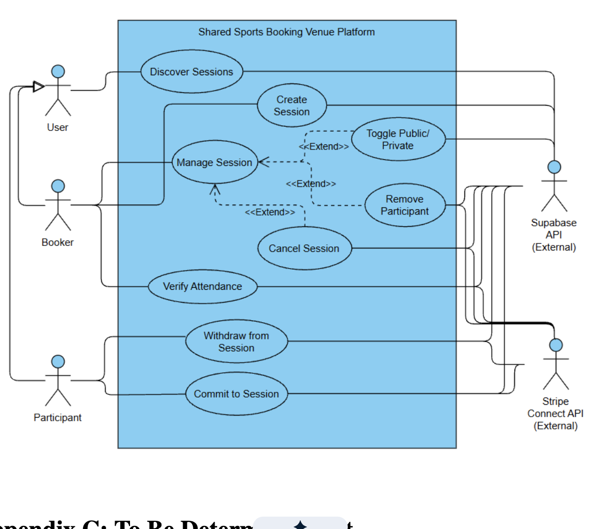

# ADR-0001: Use-case-driven development

- Status: Accepted
- Date: 2026-09-15

## Context

The system is developed from the SRS use cases. Use-case IDs such as `UC1-01`
and `UC2-04` are the shared vocabulary for requirements, acceptance tests,
implementation work, commits, and pull requests.

Most of the defined use cases already have corresponding domain behavior and
acceptance-test coverage under [`tests/use-cases`](../../tests/use-cases/). The
repository therefore needs a stable boundary for future orchestration without
creating a second place where business rules can drift from the domain model.

## Decision

We use use-case-driven development. Each feature starts from a concrete SRS
use case and follows this path:

1. Reserve or complete its acceptance test using the matching UC ID.
2. Put business invariants and state transitions in the appropriate aggregate
   or domain policy.
3. Add a use-case coordinator only when the workflow must load multiple pieces
   of state, invoke domain commands, or commit cross-aggregate effects.
4. Connect framework and infrastructure adapters through explicit ports and
   transaction boundaries.

The top-level [`/use-cases`](../../use-cases/) directory is the reserved,
framework-independent boundary for those coordinators. At present it contains
only [`use-cases/shared`](../../use-cases/shared/), which holds reusable ports,
contracts, transaction types, and coordination helpers. Capability-specific
use-case implementations are added only when a concrete use case requires
them; the empty capability space is intentional.

Use-case work is organized by business capability and traced by UC ID, rather
than collected into a generic service module. The acceptance tests remain in
`tests/use-cases/`, separate from production code.

## Example: session use cases

The session portion of the SRS is a useful example of the intended shape. The
diagram shows the actors and external systems around discovery, creation,
commitment, withdrawal, management, attendance verification, cancellation, and
participant removal:



The corresponding production boundary would be organized by use case rather
than by one large session service:

```text
use-cases/
├── shared/
│   ├── contracts.ts
│   ├── dependencies.ts
│   ├── helpers.ts
│   └── ports.ts
└── sessions/
    ├── DiscoverSessions.ts
    ├── CreateSession.ts
    ├── ManageSession.ts
    ├── ToggleSessionVisibility.ts
    ├── RemoveParticipant.ts
    ├── CancelSession.ts
    ├── VerifyAttendance.ts
    ├── WithdrawFromSession.ts
    └── CommitToSession.ts
```

For example, `use-cases/sessions/DiscoverSessions.ts` would coordinate the
inputs and query ports needed to discover sessions, while `domain/sessions`
would continue to own session invariants and state transitions. Supabase and
Stripe remain external adapters; they are not imported directly by the use-case
coordinator. This is an illustrative target structure, not a claim that every
file above currently exists.

## What belongs in `/use-cases`

- Framework-independent workflow coordination.
- Loading authoritative aggregates and read-side facts through ports.
- Calling domain commands and persisting their results in one unit of work.
- Cross-aggregate sequencing, idempotency coordination, and durable intent
  creation.
- Shared contracts and ports under `/use-cases/shared/`.

## What does not belong in `/use-cases`

- Domain entities, value objects, invariants, or business policy; those belong
  in `/domain`.
- Next.js pages, route handlers, HTTP DTO parsing, authentication plumbing, or
  UI concerns; those belong in `/app` and `/components`.
- Supabase queries, Stripe calls, payment-provider adapters, or other external
  API clients; those belong in their infrastructure/integration boundaries.
- Database migrations, schema definitions, or ledger implementations.
- A catch-all `services.ts` containing unrelated workflows or duplicated domain
  rules.
- External API calls inside a database transaction.

## Consequences

This keeps the domain model authoritative while making multi-step workflows
easy to locate and trace back to the SRS. It also means a new use case may be
represented by tests and domain behavior before a dedicated coordinator is
needed. Future additions should extend the smallest capability-specific area
that satisfies the use case instead of pre-implementing the entire layer.
