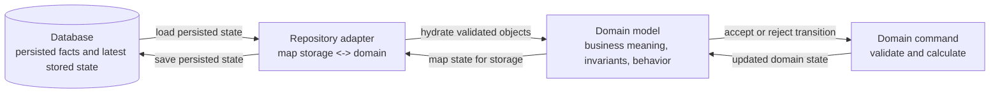

# ADR-0002: Constructor-based domain hydration

- Status: Accepted
- Date: 2026-09-15

## Context

Domain classes previously exposed `snapshot()` and `reconstitute()` methods and
parallel `*Snapshot` types. Those representations also appeared inside ordinary
state transitions and defensive copies. Simple identities such as `Wallet` had
separate creation and reconstruction methods that performed the same work.

The application uses state-based persistence contracts and has no domain-event
replay mechanism. Snapshots can be used without event sourcing, but this
application does not need a separate domain serialization API: adapters can
construct domain objects from existing state through normal constructors.

This decision complements [ADR-0001](./0001-use-case-driven-development.md):
business rules remain in the domain, and infrastructure connects through ports.

## Decision

### Separate persisted state from domain authority

There are two different kinds of source of truth. The database is authoritative
for persisted facts and the latest stored state. The domain is authoritative for
what that state means, which transitions are valid, and which business rules
apply. The adapter is the translation boundary between them; it does not make
business decisions.



The domain is therefore not a second database, and the database is not a second
domain model. On reads, stored data is mapped into valid domain objects. On
writes, a domain command determines the next valid state, which the adapter
persists. A database row is authoritative for what was stored; the domain is
authoritative for whether a change is allowed and what it means.

### Constructors accept valid domain state

Hydration means constructing objects from existing state. Domain entities and
structured values have public constructors with named arguments. Constructors
validate state invariants, copy mutable inputs, and accept valid existing
lifecycle states, including inactive users, completed payouts, and ended
sessions. Invalid state fails validation regardless of its source.

Nested arguments are domain objects: a `Session` takes a `Booking` and
`Participation` objects; a `Participation` takes a `FundHold`; a `User` takes an
optional `PayoutAccount`, a required `Wallet` with complete committed transaction
history, and loaded reliability and membership values. Constructor argument types describe domain values,
not database rows or a parallel persistence representation. A hydrated user is
complete: missing related data is an error, not an empty balance or default
score. Wallet ownership must match the user, and every transaction must belong
to the wallet. The wallet validates entry types, unique transaction IDs, and
nonnegative derived funds within safe integer cents. The adapter
supplies a `ReliabilityScore` calculated from this user's history;
`ReliabilityScore.fromHistory` checks history ownership during calculation.

```ts
const wallet = new Wallet({ walletId, userId, transactions });

const existingUser = new User({
  userId,
  email: null,
  accountStatus: "INACTIVE",
  preferredSports: new Set(),
  preferredRegions: new Set(),
  payoutAccount, // An already constructed PayoutAccount, if present.
  wallet,
  reliabilityScore, // ReliabilityScore calculated from this user's history.
  memberGroupIds, // Loaded memberships, not owned group entities.
});
```

### Factories express creation rules

Keep factories where creation applies business rules, calculates values, or
sets lifecycle defaults. Registration starts an active user; session creation
requires an eligible booker and an upcoming booking; payout creation calculates
the settlement amount. Factories invoke validated constructors.

```ts
const registeredUser = User.create({ userId, email, walletId, now });
```

Registration establishes the wallet with empty transactions and zero funds, empty
memberships, and the existing empty-history default from `ReliabilityScore.fromHistory`.
It creates domain state only; durable wallet provisioning belongs to the future
registration adapter and transaction.

Hydration calls constructors without repeating creation workflows, resetting
lifecycle fields, generating replacement identities or timestamps, or producing
external effects. Constructors and factories perform no database or network IO.
Classes whose factories only forwarded validated arguments use constructors
directly. Existing value-object factories such as `Money.fromCents()` continue
to express their units and meaning.

### Adapters own storage mapping

Repository adapters map database column names, JSON, stored timestamps, and
primitives to domain values. They assemble children and required related values
before calling parent constructors. User reads load wallet identity, its complete
committed transaction history, calculated reliability, and memberships consistently
within the transaction. A partial history must not hydrate a wallet.
`wallet.getFunds()` calculates spendable funds synchronously from those entries.
For writes, adapters map owned state to storage: saving `User` persists its
owned state and wallet identity, without rewriting ledger history or persisting
derived funds, scores, or memberships. These mappings and storage schemas stay outside the
domain.

Loaded wallet transactions and user projections remain fixed for that instance.
After ledger or membership changes, reload the user and obtain a new participant before another
admission. Future adapters must observe their transaction's writes and prevent
concurrent overspending; object construction alone provides neither guarantee.
See [ADR-0004](./0004-participant-join-and-session-admission.md).

`Repository<T>` continues to load and save domain objects. Domain classes expose
behavior and ordinary properties, with no persistence-specific `snapshot()`,
`reconstitute()`, `toPersistence()`, or equivalent whole-object conversion API.
This decision establishes the convention for future adapters; it does not add
an adapter implementation.

### Encapsulation and atomic commands remain domain concerns

Immutable children can be shared directly. Constructors and getters copy mutable
dates, collection containers, and settlement data so callers cannot change
aggregate state through aliases. Aggregate lifecycle changes pass through domain
commands, and immutable child transitions return new instances.

Commands calculate and validate proposed changes before applying them. Settlement
preparation and completion construct their results before updating the session,
so a failure leaves existing state unchanged without a serialization-based
rollback mechanism. Database transaction rollback remains the adapter's concern.

## Consequences

- Domain code has one validated construction path and no parallel snapshot API.
- Adapters perform explicit mapping and must supply coherent domain state;
  invalid stored state fails constructor validation instead of being silently
  repaired or reset through creation defaults.
- Constructor changes may require corresponding adapter and fixture updates.
  Public constructors validate state, not actor authorization; application
  workflows still invoke the appropriate creation factories and commands.
- Tests construct existing states directly, assert public values and behavior,
  and verify mutation isolation and failed-command atomicity.
- Any future event-sourcing architecture or domain-event replay mechanism
  requires a separate architectural decision.
