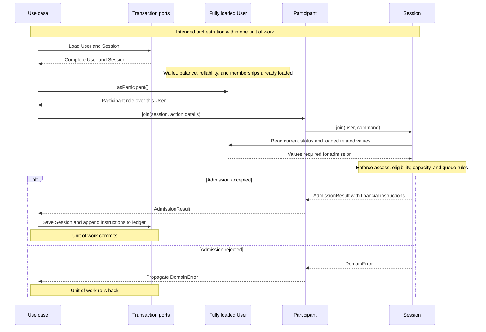

# ADR-0004: Participant join and session admission

- Status: Accepted
- Date: 2026-09-16

## Context

`User` represents a person in the booking domain. Admission needs that user's
identity, account status, wallet, available balance, calculated reliability,
and memberships. Passing these values separately through a participant command
duplicated information that a fully loaded user can expose directly.

This decision builds on
[ADR-0003: Aggregate roots and boundaries](./0003-aggregate-roots-and-boundaries.md)
and [ADR-0002: Constructor-based domain hydration](./0002-constructor-based-domain-hydration.md).

## Decision

### Load the complete user

`Repository<User>.get(userId)` returns a user with required `wallet`,
`reliabilityScore`, and `memberGroupIds` values. The owned wallet holds complete
committed transaction history and derives funds through `getFunds(): Money`.
Hydration validates wallet ownership, transaction types and ownership, unique
transaction IDs, and nonnegative derived funds within safe integer cents. Missing
related data is an error; partial transaction histories must not hydrate wallets.
Constructors copy membership and transaction arrays, retaining immutable
`LedgerTransaction` and `ReliabilityScore` objects directly.
The repository supplies the score calculated from this user's history by
`ReliabilityScore.fromHistory(userId, history, asOf)`. No admission rule needs
a calculation timestamp, so the score has no additional metadata wrapper.

The user owns its wallet; ledger writes remain external and committed entries
are authoritative for funds. The wallet calculates funds locally,
`ReliabilityScore.fromHistory` calculates scores from participation history,
and `RegularGroup` owns membership changes. Saving a
user persists its owned state and wallet identity; it never rewrites transaction
history or persists derived funds, scores, or memberships back to their sources.

A single domain model can contain several aggregates. Exposing related values
through `User` does not merge them into one aggregate. Fowler's
[Bounded Context](https://martinfowler.com/bliki/BoundedContext.html) describes
the scope of a consistent model, while his
[Aggregate](https://martinfowler.com/bliki/DDD_Aggregate.html) article describes
objects managed as a unit.

`User.create({ userId, email, walletId, now })` establishes the domain wallet
with empty transactions and zero funds, empty memberships, and the existing
empty-history default calculated by `ReliabilityScore.fromHistory`. Persisting
that new wallet belongs to the future registration adapter and transaction.

### Pass the user directly to admission

The application-facing call contains action details only:

```ts
const result = user.asParticipant().join(session, {
  participationId,
  holdId,
  now,
});
```

`Participant` holds its user and delegates directly:

```ts
join(session: Session, command: ParticipantJoinCommand): AdmissionResult {
  return session.join(this.#user, command);
}
```

`ParticipantJoinCommand` is an alias of `JoinCommand`. The session's entry points
are `join(user: User, command: JoinCommand)` and
`promoteNext(user: User, command: PromotionCommand)`. Commands contain IDs, time,
and action-specific options; they contain no copied admission data.

`Session` reads the user's identity, current account status, wallet identity,
balance, memberships, and `user.reliabilityScore`. It
enforces access, eligibility, capacity, and queue rules and returns financial
instructions. It neither retains the user as an owned child nor changes the
user's loaded projections. The former admission-input bundle, loading port,
mapping helper, and command score aliases are removed.

### Coordinate through the unit of work

The domain APIs and transaction ports exist. The following flow specifies the
intended application orchestration; no coordinator or persistence adapter is
implemented by this decision.



The use case obtains trusted users from transaction repositories rather than
constructing balances, scores, or memberships from client claims. Domain methods
perform no database or network IO. This follows the approach of placing external
reads and writes at the edges of a business operation discussed in
[Khorikov: Domain model purity vs. completeness](https://enterprisecraftsmanship.com/posts/domain-model-purity-completeness/).

Balance, reliability, and membership projections are fixed for a user instance.
Account status is live on that instance, so a participant created before user
deactivation sees the new status. After ledger or membership changes, reload the
user and obtain a new participant before another admission. Future adapters must
load consistent data, observe their transaction's writes, and protect against
concurrent overspending. A user reference provides no automatic refresh or
concurrency guarantee.

Commands still group action arguments, an ordinary
[parameter-object](https://refactoring.com/catalog/introduceParameterObject.html)
technique. A loaded user's state is not a
[domain event](https://martinfowler.com/eaaDev/DomainEvent.html): it describes
values used for a decision rather than recording that admission happened.
This flow introduces no event-publishing mechanism.

## Consequences

- Callers load a complete user once for the operation and pass action details
  to its participant role. No separate admission-data loading step remains.
- All user hydration paths must supply related values, including profile and
  booker flows. This accepts extra loading work in exchange for one complete
  user contract; there are no partially loaded users.
- Constructor validation establishes structural and ownership invariants;
  session commands remain responsible for admission policy.
- Admission results, queue ordering, financial instructions, and rejection
  behavior are preserved. Deactivation commands retain their separate obligation
  input contract.
- The API changes have no compatibility overloads. New schema, adapters,
  provisioning, and concurrency implementation remain separate work.
