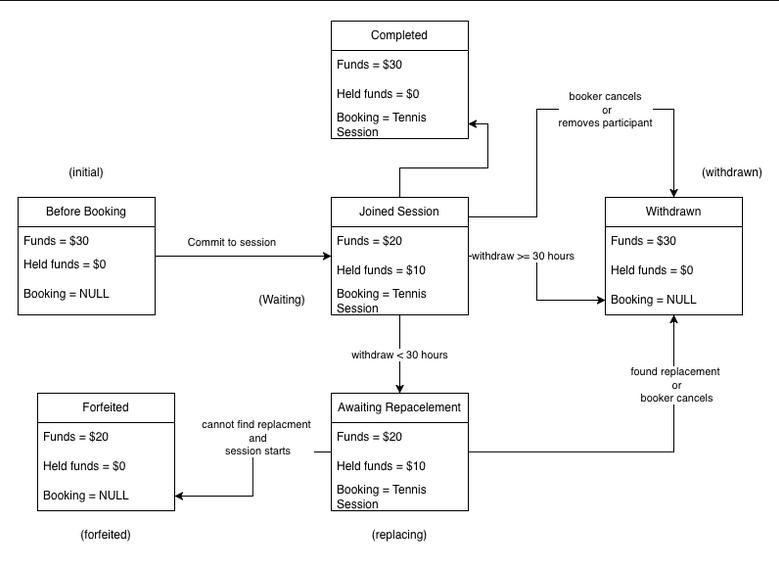

# Waitlists and replacements: product-owner discussion

**Status: proposal for discussion — no waitlist policy approved.**

The user identifies the participant state diagram below as the material already
confirmed with the product owner. The waitlist, personal-link, and reservation
rules explored afterward were working assumptions. Earlier choices in that
conversation are recorded here as proposals, not product-owner decisions.

The purpose of this discussion is to decide whether a waitlist is needed and
what promise the product should make before adding its exceptions and workflow.

**Current proposal for the first release (26 September 2026): defer the joining
waitlist.** The user selected this direction for product-owner discussion. Focus
on the replacement process in the confirmed diagram without maintaining a queue
of interested people. Product-owner approval remains pending. This choice does
not settle how replacements are accepted, matched to refunds, or given a place;
it does not approve personal links or reservations. Keep the richer waitlist
options below as deferred discussion material.

**Proposed definition of a successful replacement (26 September 2026):** the
replacement must successfully join with their full booking share held before
the withdrawing participant receives a refund. For example, Ben withdraws
12 hours before start with $10 held. Cara agrees to replace him but has only $5
available. Her agreement or unsuccessful joining attempt does not refund Ben;
he remains awaiting replacement with his $10 held. The user selected this rule
for product-owner review; approval remains pending.

**Proposed responsibility after a successful replacement (26 September 2026):**
Ben keeps his refund once Cara successfully replaces him. If Cara then withdraws
two hours before start and nobody replaces her before the session starts, Cara
forfeits her own $10 share. Her withdrawal does not make Ben responsible again
or reverse his refund. The user selected this outcome for product-owner review;
approval remains pending.

## 1. Confirmed baseline: the supplied state diagram

| Situation shown in the diagram | Outcome shown |
| --- | --- |
| Participant commits to the session | Their share moves from available funds into held funds. In the example: $30 available becomes $20 available plus $10 held. |
| Participant withdraws at least 30 hours before start | Immediate refund. Exactly 30 hours is included. |
| Participant withdraws less than 30 hours before start | Their share stays held while they await a replacement. |
| A replacement is found before start | The awaiting participant moves to withdrawn and receives their held funds back. |
| No replacement is found and the session starts | The held share is forfeited. |
| Booker cancels or removes a joined participant | The joined participant receives their held funds back. |
| Booker cancels while a participant awaits replacement | The awaiting participant receives their held funds back. |

The diagram does not specify a queue of people waiting to join, personal links,
reserved capacity, queue priority, or how an entrant is matched to one of several
withdrawn participants. Its label “Waiting” beside “Joined Session” is not a
definition of a joining waitlist.

Two points should stay visible during review:

- **Completion balance:** the original diagram shows $30 available and $0 held
  after completion. The later conversation described paying the $10 share and
  retaining $20, which also matches the existing settlement code. Confirm the
  intended outcome and update the diagram if needed; the source above has not
  been silently corrected.
- **30-hour boundary:** the diagram says an immediate refund at exactly 30 hours.
  Current code and an existing test instead make that participant await a
  replacement. This is a diagram/code discrepancy separate from waitlist policy.

## 2. Two different groups are involved

**People waiting to join** want an available place. A policy must decide who
gets that place first and when they pay.

**Withdrawn participants waiting for a refund** already have money held. A
policy must decide whose held share is refunded when someone joins.

Choosing the next person to join does not, by itself, identify the refund
recipient. Treating these as one queue hides an important business decision.

## 3. Three possible approaches

Use this example throughout: Ben withdraws first, Alice withdraws later, and
both await replacement. Dana is first among people wanting a place; Cara is
second. Ben asks Cara to take his place.

| Option for discussion | What happens in the example? | Benefit | Tradeoff |
| --- | --- | --- | --- |
| **1. Explicit replacements, no automatic waitlist** | If Cara is accepted as Ben's replacement, Ben is refunded. Dana's interest gives no automatic priority. Alice still needs a replacement. | Fewest queue and reservation rules. | Participants or the booker do more work to fill vacancies. Product must define how a replacement is verified and accepted. |
| **2. Shared openings with first-come admission** | Dana gets first chance. Under the proposed oldest-withdrawal refund rule, her successful admission refunds Ben. Ben cannot reserve the place for Cara. | One clear admission order and fewer special cases. | Someone cannot promise their place to a friend; inviting a person might refund a different withdrawing participant. |
| **3. Personal reservations plus an ordinary waitlist** | Cara takes Ben's reserved place and Ben is refunded. Dana stays first for an ordinary opening. | Supports arranging a specific replacement. | Requires separate rules for reserved places, ordinary places, admission order, and refund order. A place can remain unused while people wait. |

**Option 3 is the richer idea explored in the conversation. It is not an
approved requirement.** None of these three options is established by the state
diagram alone.

Suggested discussion order: decide whether an automatic waitlist is needed for
the first release, then choose the allocation promise. Resolve the details
below only for the chosen approach.

## 4. Assumptions explored for Option 3

Every row is awaiting product-owner review. The proposed answers preserve the
conversation so the product owner can accept, change, or reject them.

| Business scenario | Working proposal from the conversation | Decision or complexity introduced |
| --- | --- | --- |
| Alice withdrew before Ben, but Cara uses Ben's personal link. | Refund Ben when Cara successfully joins. | Does the link identify a specific replacement, or merely invite someone into the session? |
| Dana is already waiting when Ben invites Cara. | Reserve Ben's place for his personal replacement ahead of the waitlist. | Is keeping the place empty acceptable while someone else is ready to join? Does any reservation expire before session start? |
| An ordinary entrant joins while some places have personal reservations. | Use only ordinary capacity and refund the oldest eligible open-slot withdrawal. | Reserved places and their owners must be excluded from ordinary admission and refund allocation. |
| Cara has already used Ben's link; Evan uses it afterward. | Reject Evan's replacement request without charge or queue changes. He may choose ordinary joining separately. | Links need a clear active, used, or invalidated outcome. Another available place must not silently change what Evan is accepting. |
| Ben cannot find a personal replacement, but Dana is waiting. | Let Ben explicitly offer the place to the waitlist before start. Invalidate the personal link; give no refund merely for switching. | Adds a new action and a transition between the two allocation approaches. |
| Ben withdrew at 8 a.m.; Alice offered her place to the waitlist at 9 a.m.; Ben switches at 10 a.m. | Refund Ben first, using his original withdrawal time. | Choose between priority by withdrawal time and priority by time offered to the ordinary pool. |
| Cara is already second on the waitlist when Ben invites her. | Let her accept directly, pay once, and leave the queue. Dana remains first for ordinary openings. | Joining must update the reservation, payment, refund, and existing queue entry together. A failed attempt must preserve her original position. |

In all of these proposals, a late-withdrawing person's refund depends on a
replacement successfully securing and funding the place. Sharing a link,
joining a waitlist, or releasing a reservation alone would not issue a refund.
The user has explicitly selected the funded-joining definition above; it still
requires product-owner review.

## 5. Why the richer option becomes complicated

One successful personal replacement can need to change several things together:
allocate a reserved place, accept the entrant's payment, refund the intended
person, invalidate the link, and remove an existing waitlist entry. A failure
partway through must leave the prior situation intact.

It also creates product questions beyond the basic withdrawal diagram:

- Which places are actually available to an ordinary joiner?
- Can a reservation leave capacity unused while willing participants wait?
- Can a participant change allocation method, and what happens to priority?
- What does a person see when a link is used, revoked, or no longer eligible?
- How should competing attempts to claim the same place be explained to users?

These costs should be justified by a product need. Simplifying or postponing the
waitlist is a valid outcome of the discussion.

## 6. Decisions to record with the product owner

| Decision | Product-owner answer | Approval/date |
| --- | --- | --- |
| Is an automatic waitlist needed for the first release? | User proposes deferring the joining waitlist; product-owner answer pending. | Pending |
| Which allocation approach, or alternative, should the product use? | Pending | Pending |
| What counts as a successfully found replacement? | User proposes successful joining with the replacement's full booking share held before refunding the withdrawing participant; product-owner answer pending. | Pending |
| What if a successful replacement later withdraws less than 30 hours before start and finds no further replacement before start? | User proposes that the original participant keeps their refund and the replacement forfeits their own held share; product-owner answer pending. | Pending |
| Who receives the refund when several participants await replacement? | Pending | Pending |
| If personal links exist, do they reserve capacity and outrank waiting people? | Pending | Pending |
| If Option 3 is chosen, which rows in section 4 are approved or changed? | Pending | Pending |
| Should the completion example show $20 or $30 available? | Pending | Pending |

## 7. Existing implementation is not product approval

The repository already contains waitlist behavior. During the discussion, a
used-link rejection check, an action to offer a personal place to the waitlist,
and related tests were also added to the working copy. They are a **partial
implementation of discussion assumptions**, not evidence of approved scope or
a finished replacement feature.

Reserved capacity, refunding the personal-link owner, direct acceptance by an
already-waitlisted invitee, and the inclusive 30-hour correction remain
unimplemented. Existing passing tests do not settle product decisions.

The separate [Session restructuring plan](../plans/session-domain-coordinator.md)
tracks technical cleanup and the current changes. Keep that cleanup separate
from adopting a waitlist policy. Reconcile the provisional changes and tests
with the product owner's decision before treating them as requirements.
