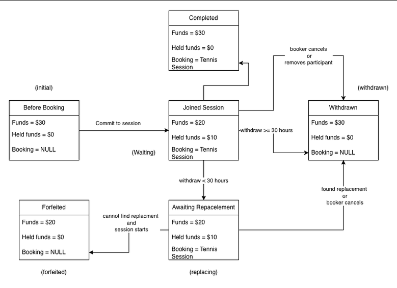

# Waitlists and replacements: product-owner discussion

**Status: session queue waitlist and two departure choices confirmed by the user
on 27 September 2026.**

When a participant leaves, the product must present these choices:

1. **Invite one named person to replace them.** One invitation reserves the
   departing person's one place, like an airplane seat. Only that named person
   can accept it; forwarding the link does not let someone else claim it.
2. **Open the place to groups / the public waitlist.** Ordinary admission uses
   the session's group/public access rules and queue.

The user explicitly confirmed “one named person” rather than a link claimable
by whoever accepts first. This supersedes the 26 September proposal to defer
the joining waitlist. [ADR-0006](../adr/0006-personal-replacement-reservations.md)
records the confirmed scope and its domain implementation consequences.

The supplied participant state diagram remains the earlier confirmed reference.
Today's confirmation does not resolve its completion-balance or exactly-30-hour
discrepancies, approve rejoining after late withdrawal, or approve all the
financial proposals below. Historical proposals are retained with their scope
and approval status visible.

## Earlier first-release proposals — historical

**Superseded proposal (26 September 2026): defer the joining waitlist.** The
user had selected this direction for product-owner discussion, with approval
pending. The 27 September confirmation replaces this proposal; it is no longer
the current direction. The separate financial and rejoining proposals below
remain under review.

**Proposed definition of a successful replacement (26 September 2026):** the
replacement must successfully join with their full booking share held before
the withdrawing participant receives a refund. For example, Ben withdraws
12 hours before start with $10 held. Cara agrees to replace him but has only $5
available. Her agreement or unsuccessful joining attempt does not refund Ben;
he remains awaiting replacement with his $10 held. The user selected this rule
for product-owner review; approval remains pending.

**Proposed responsibility after a successful replacement (26 September 2026):**
Ben keeps his refund once Cara successfully replaces him. If Cara then withdraws
two hours before start and nobody replaces her before the session starts, Cara
forfeits her own $10 share. Her withdrawal does not make Ben responsible again
or reverse his refund. The user selected this outcome for product-owner review;
approval remains pending.

**Proposed limit on booker refund exceptions (26 September 2026):** Ben withdraws
two hours before start, nobody replaces him, and the session will still go
ahead. The booker cannot waive Ben's charge individually under the first-release
proposal. Ben remains awaiting replacement; his share is refunded if a
replacement successfully joins or the booker cancels the session, and is
forfeited if he remains withdrawn without a replacement at start. This does not
change the diagram's refund when the booker removes a still-joined participant.
The user selected this limit for product-owner review; approval remains pending.

**Proposed return after a late withdrawal (26 September 2026):** Ben withdraws
two hours before start and his $10 remains held. Nobody replaces him. Thirty
minutes before start, he can attend again and a place is still available. Let
Ben rejoin using his existing held $10, without charging him again. This choice
applies before the session starts while his original share remains held and he
has not been replaced; it does not decide rejoining after a refund or a completed
replacement. The user selected this outcome for product-owner review; approval
remains pending. The current code rejects this return, and the supplied diagram
does not show it.

## 1. Confirmed baseline: the supplied state diagram

| Situation shown in the diagram | Outcome shown |
| --- | --- |
| Participant commits to the session | Their share moves from available funds into held funds. In the example: $30 available becomes $20 available plus $10 held. |
| Participant withdraws at least 30 hours before start | Immediate refund. Exactly 30 hours is included. |
| Participant withdraws less than 30 hours before start | Their share stays held while they await a replacement. |
| A replacement is found before start | The awaiting participant moves to withdrawn and receives their held funds back. |
| No replacement is found and the session starts | The held share is forfeited. |
| Booker cancels or removes a joined participant | The joined participant receives their held funds back. |
| Booker cancels while a participant awaits replacement | The awaiting participant receives their held funds back. |

The diagram does not specify a queue of people waiting to join, personal links,
reserved capacity, queue priority, or how an entrant is matched to one of several
withdrawn participants. Its label “Waiting” beside “Joined Session” is not a
definition of a joining waitlist.

Two points should stay visible during review:

- **Completion balance:** the original diagram shows $30 available and $0 held
  after completion. The later conversation described paying the $10 share and
  retaining $20, which also matches the existing settlement code. Confirm the
  intended outcome and update the diagram if needed; the source above has not
  been silently corrected.
- **30-hour boundary:** the diagram says an immediate refund at exactly 30 hours.
  Current code and an existing test instead make that participant await a
  replacement. This is a diagram/code discrepancy separate from waitlist policy.

## 2. Two different groups are involved

**People waiting to join** want an available place. A policy must decide who
gets that place first and when they pay.

**Withdrawn participants waiting for a refund** already have money held. A
policy must decide whose held share is refunded when someone joins.

Choosing the next person to join does not, by itself, identify the refund
recipient. Treating these as one queue hides an important business decision.

## 3. Historical alternatives

Use this example throughout: Ben withdraws first, Alice withdraws later, and
both await replacement. Dana is first among people wanting a place; Cara is
second. Ben asks Cara to take his place.

| Option for discussion | What happens in the example? | Benefit | Tradeoff |
| --- | --- | --- | --- |
| **1. Explicit replacements, no automatic waitlist** | If Cara is accepted as Ben's replacement, Ben is refunded. Dana's interest gives no automatic priority. Alice still needs a replacement. | Fewest queue and reservation rules. | Participants or the booker do more work to fill vacancies. Product must define how a replacement is verified and accepted. |
| **2. Shared openings with first-come admission** | Dana gets first chance. Under the proposed oldest-withdrawal refund rule, her successful admission refunds Ben. Ben cannot reserve the place for Cara. | One clear admission order and fewer special cases. | Someone cannot promise their place to a friend; inviting a person might refund a different withdrawing participant. |
| **3. Personal reservations plus an ordinary waitlist** | Cara takes Ben's reserved place and Ben is refunded. Dana stays first for an ordinary opening. | Supports arranging a specific replacement. | Requires separate rules for reserved places, ordinary places, admission order, and refund order. A place can remain unused while people wait. |

**The core allocation choice in Option 3 is now confirmed:** a joining waitlist
alongside a personal reservation for one named replacement. The state diagram
alone did not establish this; the user confirmed it on 27 September. Financial
matching details and other scenarios below must still be distinguished from
that confirmed choice.

## 4. Historical assumptions explored for Option 3

These rows preserve the earlier conversation. The confirmation above settles
the queue and named-seat allocation choice; it does not blanket-approve every
proposed answer. Section 6 distinguishes that confirmation from unresolved
product policies, and section 7 describes the domain behavior implemented with it.

| Business scenario | Working proposal from the conversation | Decision or complexity introduced |
| --- | --- | --- |
| Alice withdrew before Ben, but Cara uses Ben's personal link. | Refund Ben when Cara successfully joins. | Does the link identify a specific replacement, or merely invite someone into the session? |
| Dana is already waiting when Ben invites Cara. | Reserve Ben's place for his personal replacement ahead of the waitlist. | Is keeping the place empty acceptable while someone else is ready to join? Does any reservation expire before session start? |
| An ordinary entrant joins while some places have personal reservations. | Use only ordinary capacity and refund the oldest eligible open-slot withdrawal. | Reserved places and their owners must be excluded from ordinary admission and refund allocation. |
| Cara has already used Ben's link; Evan uses it afterward. | Reject Evan's replacement request without charge or queue changes. He may choose ordinary joining separately. | Links need a clear active, used, or invalidated outcome. Another available place must not silently change what Evan is accepting. |
| Ben cannot find a personal replacement, but Dana is waiting. | Let Ben explicitly offer the place to the waitlist before start. Invalidate the personal link; give no refund merely for switching. | Adds a new action and a transition between the two allocation approaches. |
| Ben withdrew at 8 a.m.; Alice offered her place to the waitlist at 9 a.m.; Ben switches at 10 a.m. | Refund Ben first, using his original withdrawal time. | Choose between priority by withdrawal time and priority by time offered to the ordinary pool. |
| Cara is already second on the waitlist when Ben invites her. | Let her accept directly, pay once, and leave the queue. Dana remains first for ordinary openings. | Joining must update the reservation, payment, refund, and existing queue entry together. A failed attempt must preserve her original position. |

In all of these proposals, a late-withdrawing person's refund depends on a
replacement successfully securing and funding the place. Sharing a link,
joining a waitlist, or releasing a reservation alone would not issue a refund.
The user has explicitly selected the funded-joining definition above; it still
requires product-owner review.

## 5. Why the richer option becomes complicated

One successful personal replacement can need to change several things together:
allocate a reserved place, accept the entrant's payment, refund the intended
person, invalidate the link, and remove an existing waitlist entry. A failure
partway through must leave the prior situation intact.

It also creates product questions beyond the basic withdrawal diagram:

- Which places are actually available to an ordinary joiner?
- Can a reservation leave capacity unused while willing participants wait?
- Can a participant change allocation method, and what happens to priority?
- What does a person see when a link is used, revoked, or no longer eligible?
- How should competing attempts to claim the same place be explained to users?

The user has now selected the queue and personal-seat allocation despite these
costs. UI explanations, delivery, and transaction coordination still need to
support that choice; they are not supplied by the domain implementation alone.

## 6. Decisions to record with the product owner

| Decision | Current discussion position | Product-owner approval/date |
| --- | --- | --- |
| Is the session queue waitlist needed? | Yes; the earlier proposal to defer it is superseded. | User confirmed, 2026-09-27 |
| Which choices are presented when a participant leaves? | Invite one person to replace them, or open the place to groups / the public waitlist. | User confirmed, 2026-09-27 |
| Who may accept the personal invitation? | One named person for the departing participant's one place; the link is not claimable by anyone who receives it. | User confirmed, 2026-09-27 |
| What counts as a successfully found replacement? | User proposes successful joining with the replacement's full booking share held before refunding the withdrawing participant; product-owner answer pending. | Pending |
| What if a successful replacement later withdraws less than 30 hours before start and finds no further replacement before start? | User proposes that the original participant keeps their refund and the replacement forfeits their own held share; product-owner answer pending. | Pending |
| Can the booker waive one participant's charge after that participant has already withdrawn late, while the session still goes ahead? | User proposes no individual exception in the first release; product-owner answer pending. | Pending |
| Can a late-withdrawing participant return before start when nobody has replaced them, a place remains available, and their original share is still held? | User proposes rejoining with the existing held share and no additional charge; product-owner answer pending. | Pending |
| Who receives the refund when several participants await replacement? | The domain matches personal acceptance to its departing participant and ordinary admission to the oldest eligible open-slot withdrawal. An already-refunded early departure is not refunded twice. The earlier financial proposal is not separately approved by the queue confirmation. | Separate financial-policy review pending |
| Does a personal invitation reserve a place? | The named person's one seat is reserved from ordinary admission. The implementation allows that invitee to accept from any queue position; others keep their ordinary order. | Named-seat requirement confirmed, 2026-09-27; queue handling is an implementation consequence |
| Which remaining rows in section 4 are approved or changed? | Keep their historical proposals visible; the scope above does not imply approval of unrelated financial rules or invitation expiry policy. | Review separately |
| Should the completion example show $20 or $30 available? | User proposes $20 available and $0 held after paying the $10 share. The original diagram shows $30; reconcile with the product owner. | Pending |

## 7. Current domain capability and remaining work

The domain implements the confirmed named replacement and ordinary waitlist
allocation. An `INVITE_LINK` invitation stores one token and one
`replacementInviteeId`; explicit invitation acceptance checks the token against
the matching user's participant role. The personal place stays reserved after
either early or late withdrawal. A named invitee already waiting can accept directly from any queue
position, while ordinary admissions and promotions keep FIFO order over
unreserved capacity and existing visibility/membership rules for other people.
An otherwise-authorized ordinary join by the named invitee also consumes their
reserved place, as does promotion when they reach the FIFO head. These paths
avoid stranding the invitation after its recipient joins. A matching token can
supply private invitation access; ordinary access still uses the session's
existing rules.

Successful personal acceptance holds the entrant's share, records the one
replacement through `replacesParticipationId`, and refunds that specific late
withdrawal when its share is still held. An early withdrawal has already been
refunded, so accepting its reservation issues no second refund and does not
refund an unrelated late withdrawal. Ordinary admission selects the oldest
eligible `OPEN_SLOT` late withdrawal. These are domain financial behaviors, not
evidence that all earlier financial proposals have been approved.

`offerPlaceToWaitlist` releases an active personal reservation before start,
clears its token and named recipient, and preserves the withdrawal time and
hold state. It returns no financial instructions and does not itself promote
a waiter. Failed acceptance leaves the reservation, funds, and existing queue
position unchanged.

There is no departure-choice UI, invitation delivery, application coordinator,
or persistence adapter for this flow in the repository. A future application
must load the authenticated user's identity and persist participation changes
and financial instructions atomically; the domain does not itself authenticate
requests, deliver invitations, or guarantee concurrent database writes.

The inclusive 30-hour correction and proposed return after late withdrawal
remain unimplemented. Current admission rejects rejoining after withdrawal,
including when the original share is still held. They remain separate changes
and are not implied by the confirmed waitlist scope. Existing tests do not
settle these product decisions.

The [Session restructuring plan](../plans/session-domain-coordinator.md) records
the earlier technical cleanup. References there to provisional or deferred
waitlist policy describe the earlier discussion; this document and ADR-0006
record the subsequent 27 September confirmation.
