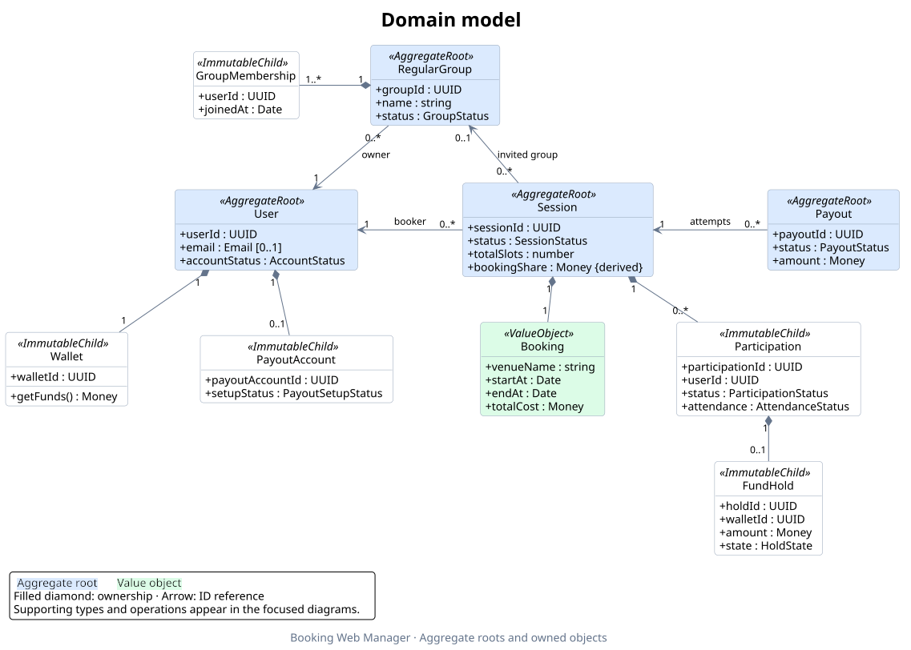

# Domain class diagram

These diagrams describe the current TypeScript domain in [`domain/`](../domain),
following [ADR-0003](./adr/0003-aggregate-roots-and-boundaries.md) and
[ADR-0004](./adr/0004-participant-join-and-session-admission.md). They document the
implementation; they do not introduce new domain behavior.

- [Editable PlantUML source](./domain-class-diagram.puml)
- [Scalable SVG diagram](./assets/domain-class-diagram.svg)



## Focused diagrams

The overview shows aggregate ownership and the main references between roots.
Operations, role views, values, and financial contracts are expanded below so
their connections can be read without lines crossing the entire domain.

| View | Covers | Diagram | Editable source |
| --- | --- | --- | --- |
| Accounts and groups | User, owned account objects, role views, and memberships | [SVG](./assets/domain-accounts.svg) | [PlantUML](./diagrams/domain-accounts.puml) |
| Sessions | Booking, participation, holds, and reliability | [SVG](./assets/domain-sessions.svg) | [PlantUML](./diagrams/domain-sessions.puml) |
| Settlement | Payout attempts and frozen settlement data | [SVG](./assets/domain-settlement.svg) | [PlantUML](./diagrams/domain-settlement.puml) |
| Ledger | Committed transactions, money, and balance queries | [SVG](./assets/domain-ledger.svg) | [PlantUML](./diagrams/domain-ledger.puml) |

## Reading the diagram

Blue classes are the four aggregate roots. Filled diamonds show logical
ownership; solid arrows show references, and dashed arrows show dependencies.
The focused diagrams include selected public properties and operations. They omit private
helpers, constructor/command argument types, most result contracts, status-union
definitions, and repetitive links to `Money`. Properties are exposed through
getters on classes and readonly fields on interfaces. Parameter types are
abbreviated.

- `Booker` and `Participant` wrap a `User`; they are role views, not subclasses.
- `Session` owns all participation records, so its roster multiplicity is `0..*`.
  Only active commitments are limited by `totalSlots` (at most eight).
  Waitlisted participation has no hold; a commitment requires one.
- `RegularGroup` retains at least one membership, including its owner.
- `User` owns its wallet, but ledger history is external. `Wallet.getFunds()`
  derives spendable funds from the complete committed transaction collection.
  Saving a user does not rewrite that history. `WalletBalance` is a separate
  query result, not the wallet's hydration state.
- Reliability and group membership IDs are loaded related values. Calculating
  reliability reads participation outcomes and session end times without
  retaining that history. Admission reads a fully loaded `User` without owning
  or modifying it.
- `Payout` owns frozen settlement lines and a destination copy; it does not own
  live holds. The session retains its own pending batch. Failed attempts remain
  recorded, and each retry has a new payout ID. Frozen account references may
  outlive the user's current payout-setup child.
- ID attributes also express references where drawing another edge would add
  clutter: session to holding account; ledger entry to wallet/hold/payout;
  settled hold to payout; settlement line to participation/wallet/holding
  account; participation to the record it replaces. Optional ledger references
  are not asserted to be mandatory for particular transaction kinds.

## Regenerate

From the repository root, using a local PlantUML installation:

```sh
rtk plantuml -tsvg -o assets docs/domain-class-diagram.puml
rtk plantuml -tpng -o assets docs/domain-class-diagram.puml
rtk plantuml -tsvg -o ../assets docs/diagrams/*.puml
```

Output directories are relative to each source file. All images are written to
`docs/assets/`; the overview also has a PNG preview. No application code changes
or network service are required to render them.
